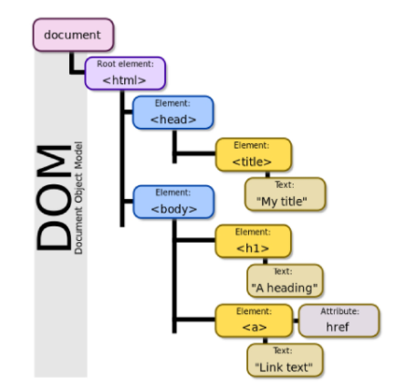

# JavaScript 01

## DOM
### 브라우저에서 할 수 있는 일

- DOM  조작

  - 문서(HTML)조작

- BOM 조작

  - navigator, screen, location, frames, history, XHR

- JavaScript Core (ECMAScript)

  DataStructure,Conditional Expretion,Iteration
  
  

### DOM

- HTML, XML과 같은 문서를 다루기 위한 문서 프로그래밍 인터페이스
- 문서를 구조화하고 구조화된 구성 요소를 하나의 객체로 취급하여 다루는 논리적 트리 모델
- 문서가 구조화되어 있으며 각 요소는 객체로 취급
- 다순한 속성 접근, 메서드 활용뿐만 아니라 프로그래밍 언어적 특성을 활용한 조작 가능
- 주요객체
  - window : DOM을 표현하는 창, 가장 최상위 객체(작성 시 생략 가능)
  - document : 페이지 컨텐츠의 Entry Point 역할을 하며, <body> 등과 같은 수많은 다른 요소들을 포함
  - navigator, location, history, screen

- Parsing
  - 구문 분석, 해석
  - 브라우저가 문자열을 해석하여 DOM Tree로 만드는 과정

### BOM

- Browder Object Model
- 자바스크립트가 브라우저와 소통하기 위한 모델
- 브라우저의 창이나 프레임을 추상화해서 프로그래밍적으로 제어할 수 있도록 제공하는 수단
  - 버튼, URL 입력창, 타이틀 바 등 브라우저 윈도우 및 웹 페이지 일부분을 제어 가능
- window 객체는 모든 브라우저로부터 지원 받으며 브라우저의 창을 지칭

### DOM 조작

- Document는 문서 한 장(HTML)에 해당하고 이를 조작
- DOM 조작 순서
  - 1. 선택 (Select)
    2. 변경 (Manipulation)

### DOM 관련 객체의 상속 구조

Event Target => Node => Element/Document => HTMLElement

- Event Target
  - Event Listener를 가질 수 있는 개체가 구현하는 DOM 인터페이스
- Node
  - 여러가지 DOM 타입들이 상속하는 인터페이스
- Element 
  - Document 안의 모든 객체가 상속하는 가장 범용적인 기반 클래스
  - 부모인 Node와 그 부목인 Event Target의 속성을 상속
- Document
  - 브라우저가 불러온 웹 페이지를 나타냄
  - Dom트리의 진입점 역할을 수행
- HTMLElement
  - 모든 종류의 HTML요소
  - 부모 element의 속성 상속

### DOM 선택 - method

- Document.querySelector(selector)
  - 제공한 선택자와 일치하는 element 하나 선택
  - 제공한 CSS selector를 만족하는 첫 번째 element 객체를 반환 (없다면 null)
- Document.querySelectorAll(selector)
  - 제공한 선택자와 일치하는 여러 element를 선택
  - 매칭 할 하나 이상의 selector를 포함하는 유효한 CSS slector를 인자로(문자열) 받음
  - 지정된 selector에 일치하는 NodeList를 반환
- getElementById(id)  - id 로 element 선택
- getElementByTagName(name)  - tag name으로 선택
- getElementByClassName(names) -  class 이름으로 선택
- querySelector(), querySelectorAll()을 사용하는 이유는 id, class, tag 등 모두 사용가능하며 더 구체적이고 유연하게 사용이 가능하기 때문이다.
  - ex) document.querySelector('#id'), document.querySelector('.name')

###  DOM 선택 method별 반환 타입

1. 단일 element

  - getElementById()
  - querySelector()
2. HTMLCollection

	- getElementByTagName()
	- getElementByClassName()
3. NodeList
   - querySelctorAll()

###  DOM 선택 - HTMLCollection & NodeList

- 둘 다 배열과 같이 각 항목에 접근하기 위한 idx를 제공(유사배열)
- HTMLCollection
  - name, id, idx 속성으로 각항목에 접근 가능
- NodeList
  - idx로만 각 항목에 접근 가능
  - 단, HTMCollection과 달리 배열에서 사용하는 forEach함수 및 다양한 메서드 사용 가능
- 둘 다 Live Collection으로 DOM의 변경사항을 실시간으로 반영하지만 querySelectorAll()에 의해 반환되는 NodeList는 Static Collection으로 신시간으로 반영되지 않음

###  DOM 선택 - Collection 

- Live Collection
  - 문서가 바뀔 때 실시간으로 업데이트 됨
  - DOM의 변경사항을 실시간으로 collection에 반영
- Static Collection
  - DOM이 변경되어도 collection 내용에는 영향을 주지 않음
  - querySelectorAll()의 반환 NodeList만 static collection

### DOM 변경관련 method

- Document.createElement()
  - 작성한 태그 명의 HTML 요소를 생성하여 반환
- Element.append()
  - 특정 부모 Node의 자식 NodeList 중 마지막 자식 다음에 Node 객체나 DOMString을 삽입
  - 여러개의 Node객체, DOMStirng을 추가 할 수 있음
  - 반환 값이 없음
- Node.appendChild()
  - 한 Node를 특정 부모 NodeList 중 마지막 자식으로 삽입(Node만 추가 가능)
  - 한번에 오직 하나의 Node만 추가할 수 있음
  - 만약 주어진 Node가 이미 문서에 존재하는 다른 Node를 참조한다면 새로운 위치로 이동
- Node.innerText
  - Node 객체와 그 자손의 텍스트 컨텐츠(DOMString)를 표현 (해당 요소 내부의 raw text)
  - 줄 바꿈을 인식하고 숨겨진 내용을 무시하는 등 최종적으로 스타일링이 적용된 모습으로 표현
- Element.innerHTML
  - element 내에 포함된 HTML 크업을 반환
  - XSS(Cross-site Scripting) 공격에 취약하기 때문에 사용 시 주의

- ChildNode.remove()
  - Node가 속한 트리에서 해당 Node를 제거
- Node.removeChild()
  - DOM에서 자식 Node를 제거하고 제거된 Node를 반환
  - Node는 인자로 들어가는 자식 Node의 부모 Node

- Element.setAttribute(name, value)
  - 지정된 요소의 값을 설정
  - 속성이 이미 존재하면 값을 갱신, 존재하지 않으면 지정된 이름과 값으로 새 속성을 추가
- Element.getAttribute(attributeName)
  - 해당 요소의 지정된 값(문자열)을 반환
  - 인자(attributeName)는 값을 얻고자 하는 속성의 이름

## Event

### 개념

- 네트워크 활동이나 사용자와의 상호작용 같은 사건의 발생을 알리기 위한 객체
- event 발생
  - 마우스 클릭, 키보드를 누름 등 사용자 행동으로 발생할 수도 있다
  - 특정 메서드를 호출하여 프로그래밍적으로도 만들어 낼 수 있음

### Event 기반 인터페이스

- AnimationEvent, ClipBoardEvent, DragEvent 등
- UIEvent
  - 간단한 사용자 인터페이스 이벤트
  - Event의 상속을 받음
  - MouseEvent, KeyboardEvent, InputEvent, FocusEvent 등의 부모 객체 역할을 함

### Event hanmdler - addEventListener()

- EventTarget.addEventListener()
  - 지정한 이벤트가 대상에 전달될 때마다 호출할 함수를 설정
  - 이벤트를 지원하는 모든 객체(element, Document, Window 등)를 대상으로 지정 가능
- target.addEventListener(type, listener[, options])
  - type
    - 반응 할 이벤트 유형 (대소문자 구분 문자열)
  - listener
    - 지정된 타입의 이벤트가 발생했을 때 알림을 받는 객체
    - EventListener 인터페이스 혹은 JS function 객체(콜백함수)여야함

### Event 취소

- Event.preventDefault()
- 현재 이벤트의 기본 동작을 중단
- 태그의 기본 동작을 작동하지 않게 막음
  - ex) a태그의 기본 동작은 클릭 시 링크로 이동 / form 태그의 기본 동작은 form 데이터 전송
- event를 취소할 수 있는 경우, event의 전파를 막지 않고 그 event를 취소
- 취소 할 수 없는 event도 존재한다
  - event의 취소 가능 여부는 event.cancelable을 사용해 확인할 수 있다.

