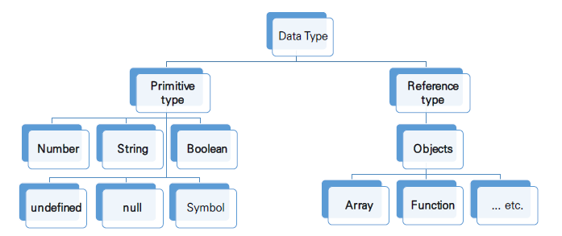

# JavaScript 02

## 변수와 식별자

### 식별자 정의와 특징

- Identifier(식별자)는 변수를 구분할 수 있는 변수명을 말함
- 식별자는 반드시 문자, $  or _(밑줄)로 시작
- 대소문자를 구분하며, 클래스명 외에는 모두 소문자로 시작
- 예약어(for, if, case 등) 사용불가능

### 식별자 작성 스타일

- camelCase - 변수, 객체, 함수에 사용
- PscalCase - 클래스, 생성자에 사용
- SNAKE_CASE(대문자 스네이크 케이스) - 상수(변경될 가능성이 없는 값)에 사용

변수 선언 키워드

- let

  - 재할당 할 수 있는 변수 선언시 사용
  - 변수 재선언 불가능
  - 블록 스코프 - if, for, 함수등의 중괄호 내부를 가리킴 / 블록 스코프를 가지는 변수는 블록 바같에서 접근 불가능

- const

  - 재할당 할 수 없는 변수 선언 시 사용
  - 변수 재선언 불가능
  - 블록 스코프 

- var

  - var로 선언한 변수는 재선언 및 재할당 모두 가능
  - ES6 이전에 변수를 선얼할 때 사용
  - 호이스팅 되는 특성으로 인해 예기치 못한 문제 발생
    - 따라서 ES6 이후부터는 const, let을 사용하는 것을 권장한다.
  - 함수 스코프 - 함수의 중괄호 내부를 가리킴 / 함수 스코프를 가지는 변수는 바깥에서 접근 불가능
  - 호이스팅 - 변수를 선언 이전에 참조할 수 있는 현상 / 변수 선언 이전의 위치에서 접근시 undefined를 반환 

- 선언, 할당, 초기화

  - 선언 - 변수를 생성하는 행위나 시점
  - 할당- 선언된 변수에 값을 저장하는 행위나 시점
  - 초기화 - 선언된 변수에 처음으로 값을 저장하는 행위나 시점

## 함수

### 함수 in JS

- 참조 타입 중 하나이며, function 타입에 속함
- JS에서 함수를 정의하는 방법은 선언식과 표현식으로 구분된다.
- JS에서 함수는 일급 객체이다
  - 일급객체란?
    - 변수에 할당 가능
    - 함수의 매개변수로 전달 가능
    - 함수의 반환 값으로 사용 가능

### 함수 선언식(function statement, declaration)

- 함수의 이름과 함께 정의하는 방식
- 함수의 이룸(name), 매개변수(args), 몸통으로 구성(중괄호 내부)

### 함수 표현식(function expression)

- 함수를 표현식(어떤 하나의 값으로 결정되는 코드의 단위) 내에서 정의하는 방식

- 함수의 이름을 생략하고 익명 함수(이름이 없는 함수, 표현식에서만 사용 가능)로 정의가능
- 함수의 이름(생략 가능), 매개변수, 몸통(중괄호 내부) 로 구성

### 기본인자(default arguments)

- 인자 작성시 '=' 문자 뒤 기본 인자 선언 가능

|        |                   함수 선언식                   |                   함수 표현식                   |
| :----: | :---------------------------------------------: | :---------------------------------------------: |
| 공통점 | 데이터 타입, 함수 구성요소(이름 매개변수, 몸통) | 데이터 타입, 함수 구성요소(이름 매개변수, 몸통) |
| 차이점 |          익명함수 불가능/호이스팅 가능          |          익명함수 가능/호이스팅 불가능          |
|  비고  |                                                 |          Airbnb Style Guide 권장 방식           |

### 함수의 타입

- 선언식, 표현식 보두 타입은 function

### 호이스팅 

- 함수 선언식
  - 함수 선언식으로 선언한 함수는 var로 정의한 변수처럼 hoisting 발생
  - 함수 호충 이후에 선언해도 동작
- 함수 표현식
  - 함수 표현식으로 선언한 함수는 함수 정의 전에 호출시 에러 발생
  - 함수 표현식으로 정의된 함수는 변수로 평가되어 변수의 scope 규칙을 따름
  - 함수 표현식을 var 키워드로 작성한 경우, 변수가 선언 전 undefined로 초기화 되어 다른 에러가 발생

### 화살표 함수

- 함수를 비교적 간결하게 정의할 수 있는 문법
- function 키워드 생략 가능
- 함수의 매개변수가 단 하나 뿐이라면 '()'도 생략 가능
- 함수 몸통이 표현식 하나라면 '{}'과 return도 생략가능

## 조건문과 반복문

## 조건문

### 조건문의 종류 & 특징

- 'if' statement
  - 조건 표현식의 결과값을 Boolean 타입으로 변환 후 참/거직을 판단
- 'switch' statement
  - 조건 표현식의 결과값이 어느 값(case)에 해당하는지 판별
  - 주로 특정 변수의 값에 따라 조건을 분기할 때 사용
    - 조건이 많아질 경우 if문 보다 가독성이 나을 수 있다.

### if statement

- if, else if, else
  - 조건은 소괄호(condition)안에 작성
  - 실행할 코드는 중괄호{} 안에 작성
  - 블록 스코프 생성

### switch statement

- switch
  - 표현식의 결과값을 이용한 조건문
  - 표현식의 결과값과 case문의 오른쪽 값을 비교
  - break 및 default문은 [선택적]으로 사용 가능
  - break문이 없는 경우 break문을 만나거나 default문을 실행할 때까지 다음 조건문 실행
  - 블록스코프 생성

## 반복문

### 반복문 종류 & 특징

- while
  - 조건문이 true인 동안 반복 시행
  - 조건은 소괄호 안에 작성
  - 실행할 코드는 중괄호안에 작성
  - 블록 스코프 생성
- for
  - 세미콜론(;)으로 구분되는 세 부분으로 구성
  - initialization
    - 최초 반복문 진입 시 1회만 실행되는 부분
  - condition
    - 매 반복 시행 전 평가되는 부분
  - expression
    - 매 반복 시행이후 평가되는 부분
  - 블록 스코프 생성

- for   in

  - 주로 객체의속성들을 순회할 때 사용
  - 배열도 순회 가능하지만 인덱스 순으로 순회한다는 보장이 없으므로 권장하지 않음
  - 실행 코드는 중괄호 안에 작성
  - 블록 스코프 생성

- for   of

  - 반복가능한(iterable)객체를 순회하며 값을 꺼낼 때 사용
    - 반복 가능한 객체의 종류: Array, Map, Set, String 등
  - 실행할 코드는 중괄호 안에 작성
  - 블록 스코프 생성

## 데이터 타입

### 데이터 타입 종류

- JS의 모든 값은 특정한 데이터 타입을 가짐
- 크게 원시타비(Premitive type)과 참조타입(Reference type)으로 분류됨

- 원시타입
  - 객체가 아닌 기본타입
  - 변수에 해당 타입의 값이 담김
  - 다른 변수에 복사할 때 실제 값이 복사됨
  - 숫자 타입
    - 정수, 실수 구분없는 하나의 숫자 타입
    - 부동소수점을 형식을 따름
    - NaN(Not A Number) - 계산 불가능한 경우 반환되는 값
  - 문자열 타입
    - 텍스트 데이터를 나타내는 타입
    - 16비트 유니코드 문자의 집합
    - 작은따옴표 또는 큰따옴표 모두 가능
    - Template Literal
      - ES6부터 지원
      - quotes('', "") 대신 backtick(`)으로 표현
      - ${expression}형태로 삽입 가능
  - undefined
    - 변수의 값이 없음을 나타내는 데이터 타입
    - 변수 선언 이후 직접 값을 할당하지 않으면, 자동으로 undefined가 할당됨
    - typeof 연산자의 결과는 undefined
  - null
    - 변수의 값이 없음을 의도적으로 표현할 때 사용하는 데이터 타입
    - null 타입과 typeof연산자
      - typeof연산자 : 자료형 평가를 위한 연산자
      - null타입은 ECMA 명세의 원시 타입의 정의에 따라 원시 타입에 속하지만, typeof 연산자의 결과는 객체로 표현됨
  - Boolean 타입
    - 논리적 참 또는 거짓을 나타내는 타입
    - ture or false로 표현
    - 조건문 또는 반복문에서 유용하게 사용
      - 조건문 또는 반복문에서boolean이 아닌 데이터 타입은 자동 형변환 규칙에 따라 ture or false로 변환된다.
      - 자동 형변환 정리

| 데이터 타입 |    거짓    |        참        |
| :---------: | :--------: | :--------------: |
|  Undefined  | 항상 거짓  |        x         |
|    Null     | 항상 거짓  |        x         |
|   Number    | 0, -0, NaN | 나머지 모든 경우 |
|   String    | 빈 문자열  | 나머지 모든 경우 |
|   Object    |     x      |     항상 참      |

- 참조 타입
  - 객체 타입의 자료형
  - 변수에 해당 객체의 참조 값이 담김
  - 다른 변수에 복사할 때 참조 값이 복사됨

##  연산자

### 할당연산자

- 오른쪽에 있는 피연산자의 평가 결과를 왼쪽 피연산자에 할당하는 연산자
- 다양한 연산에 대한 단축 연산자 지원
- Increment 및 Decrement 연산자
  - Increment(++) : 피연산자의 값을 1 증가시키는 연산자
  - Decrement(--) : 피연산자의 값을 1 감소시키는 연산자
  - Airbnb Style Guide에서는 '+=' or '-='와같이 더 분명한 표현으로 적을 것을 권장

### 비교연산자

- 피연산들(숫자, 문자, Boolean 등)을 비교하고 결과값을 boolean으로 반환하는 연산자
- 문자열은 유니코드 값을 사용하며 표준 사전 순서를 기반으로 비교
  - ex) 알파벳끼리 비교할 경우 후순위가 더크며 소문자가 대문자보다 크다.

### 동등 비교 연산자(==)

- 두 피연산자가 같은 값으로 평가되는지 비교 후 boolean 값을 반환
- 비교할 때 암묵적 타입 변환을 통해 타입을 일치시킨후 같은 값인지 비교
- 두 피연산자가 모두 객체일 경우 메모리의 같은 객체를 바라보는지 판별
- 예상치 못한 결과가 발생할 수 있으므로 특별한 경우를 제외하고 사용하지 않는다.

### 일치 비교 연산자(===)

- 두 피연산자가 같은 값으로 평가되는 비교 후 boolean 값을 반환
- 엄격한 비교가 이뤄지며 암묵적 타입 변환이 발생하지 않는다.
  - 엄격한 비교: 두 비교 대상의 타입과 값 모두 같은지 비교하는 방식
- 두 피연산자가 모두 객체일 경우 메모리의 같은 객체를 바라보는지 판별

### 논리 연산자

- 세가지 논리 연산자로 구성
  - and : '&&'
  - or : '||'
  - not : '!'
- 단축 평가 지원

### 삼항 연산자(Ternary Operator)

- 세 개의 피 연산자를 사용하여 조건에 따라 값을 반환하는 연산자
- 가장 왼쪽의 조건식이 참이면 콜론(:) 앞의 값을 사용하고 그렇지 않으면 콜론(:) 뒤의 값을 사용
- 삼항 연산자의 결과는 변수에 할당 가능
- 한 줄에 표기하는 것을 권장

## 배열

### 배열의 정의 & 특징

- 키와 속성들을 담고 있는 참조 타입의 객체
- 순서를 보장하는 특징이 있음
- 주로 대괄호를 이용하여 생성하고, 0을 포함한 양의 정수 인덱스로 특정 값에 접근 가능
- 배열의 길이는 array,.length 형태로 접근 가능 (마지막 원소는 array.length -1 로 접근)

### 배열 관련 주요 메서드

#### 기본 배열 조작

- array.reverse()
  - 원본 배열의 요소들의 순서를 반대로 정렬

- array.push()
  - 배열의 가장 뒤에 요소 추가
- array.pop()
  - 배열의 마지막 요소 제거
- array.unshift()
  - 배열의 가장 앞에 요소 추가
- array.shift()
  - 배열의 첫번째 요소 제거
- array.includes(value)
  - 배열에 특정 값이 존재하는지 판별 후 true or false 반환
- array.indexOf(value)
  - 배열의 특정 값이 존재하는지 확인 후 가장 첫 번째로 찾은 요소의 인덱스 반환
  - 만약 해당 값이 없을 경우 -1 반환
- array.join([separator])
  - 배열의 모든 요소를 연결하여 반환
  - seperator(구분자)는 선택적으로 지정 가능하다. default = 쉼표(,)

#### Array Helper Methods

- 배열을 순회하며 특정 로직을 수행하는 메서드
- 메서드 호출 시 인자로 callback함수를 받는 것이 특징
  - callback함수 : 어떤 함수릐 내부에서 실행될 목적으로 인자로 넘겨받는 함수를 말함

- array.forEach(callback(element[,index[,array]]))
  - 배열의 각 요소에 대해 callback 함수를  번씩 싱행
  - 콜백함수는 3가지 매개변수로 구성
    - element : 배열의 요소
    - index : 배열 요소의 index
    - array : 배열 그 자체
  - 반환 값(return)이 없는 메서드
- array.map(callback(element[,index[,array]]))
  - 배열의 각 요소에 대해 콜백 함수를 한 번씩 실행
  - 콜백 함수의 반환 값을 요소로 하는 새로운 배열 반환
  - 기존 배열 전체를 다른 형태로 바꿀 때 유용
- array.filter(callback(element[,index[,array]]))
  - 배열의 각 요소에 대해 콜백 함수를 한 번씩 실행
  - 콜백 함수의 반환 값이 참인 요소들만 보아서 새로운 배열을 반환
  - 기존 배열의 요소들을 필터링 할 때 유용
- array.reduce(callback(acc, element, [index[, array]])[, initialValue]))
  - 배열의 각 요소에 대해 콜백 함수를 한 번씩 실행
  - 콜백 함수의 반환 값들을 하나의 값(acc)에 누적 후 반환
  - reduce 메서드의 주요 ㅐ개변수
    - acc
      - 이전 콜백함수의 반환 값이 누적되는 변수
    - initialValue(optional)
      - 최초 콜백함수 호출 시 acc에 할당되는 값, default값은 배열의 첫 번째 값
  - 빈 배열의 경우 initialValue를 제공하지 않으면 에러 발생
- array.find(callback(element[,index[,array]]))
  - 배열의 각 요소에 대해 콜백 함수를 한 번씩 실행
  - 콜백 함수의 반환 값이 참이면 해당 요소를 반환
  - 찾는 값이 배열에 없으면 undefined 반환
- array.some(callback(element[,index[,array]]))
  - 배열의 요소 중 하나라도 주어진 판별 함수를 통과하면 참을 반환
  - 모든 요소가 통과하지 못하면 거짓 반환
  - 빈 배열은 항상 거짓 반환
- array.every(callback(element[,index[,array]]))
  - 배열의 모든 요소가 주어진 판별 함수를 통과하면 참을 반환
  - 모든 요소가 통과하지 못하면 거짓 반환
  - 빈 배열은 항상 참 반환

## 객체(Objects)

### 객체의 정의 & 특징

- 객체는 속성의 집합이며, 중괄호 내부에 key와 value의 쌍으로 표현된다.
- key는 문자열 타입만 가능하다.
  - key 이름에 띄어쓰기 등의 구분자가 있으면 따옴표로 묶어서 표현
- value는 모든 타입 가능
- 객체 요소 접근은 점 또는대괄호로 가능
  - key 이름에 띄어쓰기 같은 구반자가 있으면 대괄호 접근만 가능

### 객체 관련 ES6 문법 익히기

- ES6에 새로 도입된 문법들로 객체 생성 및 조작에 유용하게 사용 가능
  - 속성명 축약
    - 객체를 정의할 때 key와 할당하는 변수의 이름이 같으면 축약 가능
  - 메서드명 축약
    - 메서드 선언 시 function 키워드 생략 가능
      - 메서드 : 어떤 객체의 속성이 참조하는 함수
  - 계산된 속성명 사용하기
    - 객체를 정의할 때 key의 이름을 표현식을 이용하여 동적으로 생성 가능
  - 구조 분해 할당
    - 구조 분해 할당은 배열도 가능함
    - 배열 또는 객체를 분해하여 속성을 변수에 수비게 할당할 수 있는 문법

### JSON(JavaScript Object Notation)

- key-value쌍의 형태로 데이터를 표기하는 언어 독립적 표준 포맷
- JS의 객체와 유사하게 생겼으나 실제로는 문자열 타입
  - JS의 객체로써 조작하기 위해서는 구문 분석(parsing)이 필수
- JS에서는 JSON을 조작하기 위한 두 가지 내장 메서드를 제공
  - JSON.parse()
    - JSON => JS 객체
  - JSON.stringify()
    - JS 객체 => JSON

